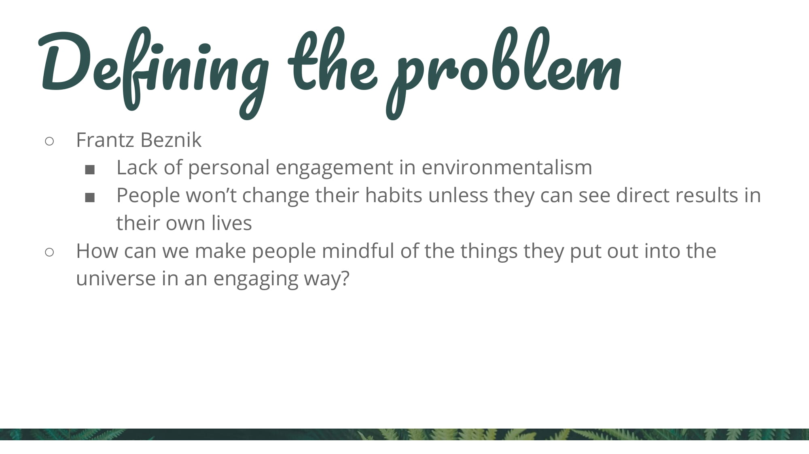
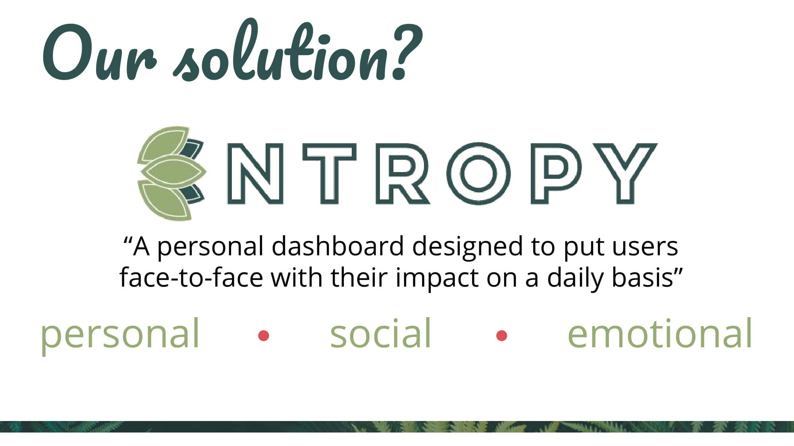
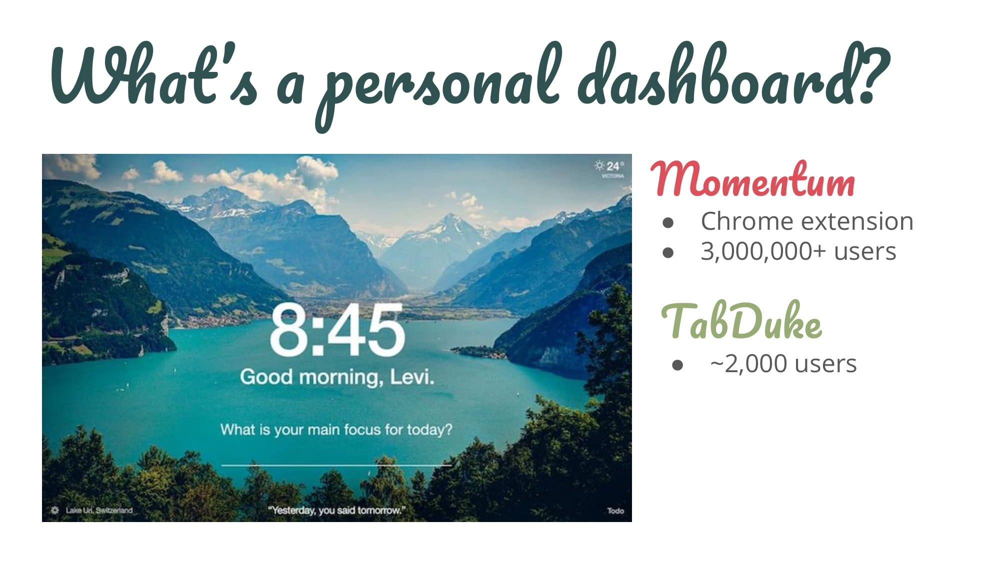
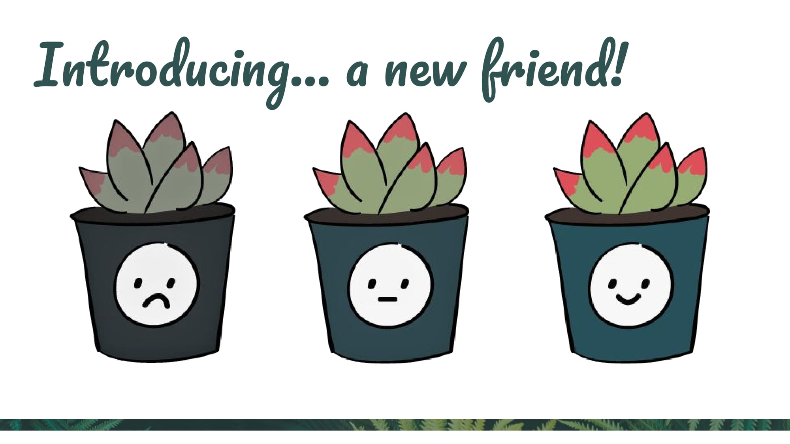
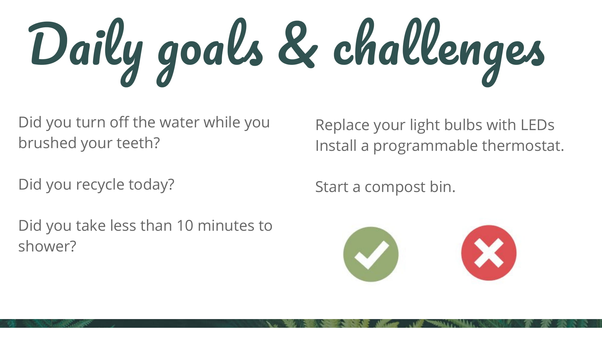
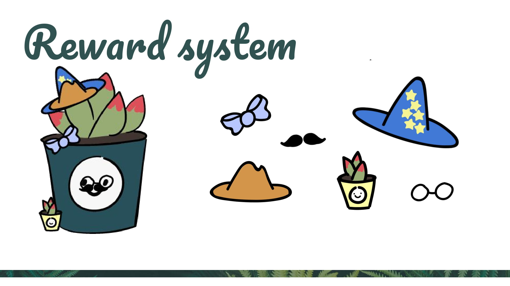
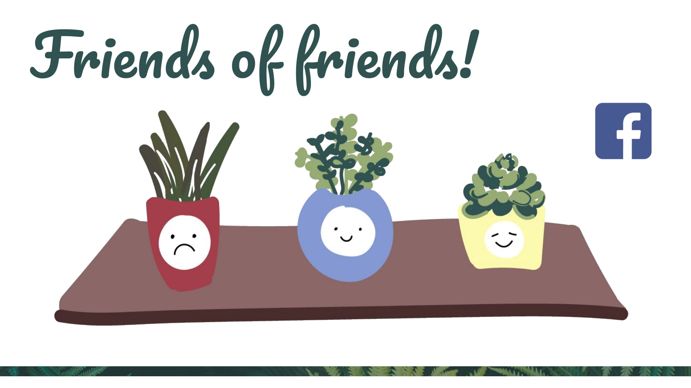
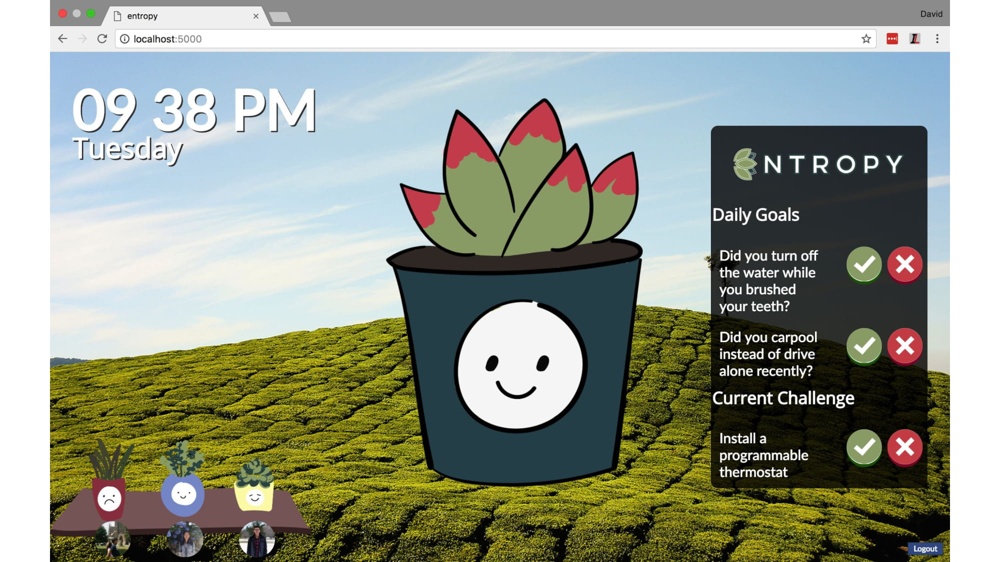

# entropy
Entropy is a prototype of a project started at Duke Blueprint 2018. It was envisioned as a Google Chrome extension that replaces the new tab page of a browser. Entropy aims at creating associations of daily actions and behaviors with immediate feedback, and attempts to reconnect users with nature through goals.

Team: Daniel Zhou, David Cheng, Grant Kim, Jane Li, Vicki Lu

Graphics created by Vicki Lu and Jane Li

